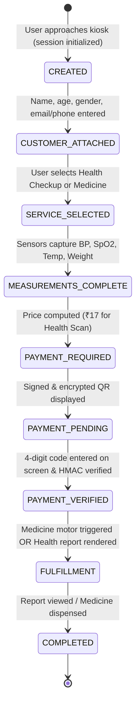

# Reliv Kiosk Backend — System & Architecture Map
> **Quick Reference for AI Agents & Developers:** Consult this document to understand the repository structure, data flows, APIs, and business rules without re-reading the entire codebase.

---

## 1. System Overview

Reliv Kiosk Backend is an **offline-first medical and wellness kiosk platform** designed to operate on a Raspberry Pi 4/5 inside an offline health station. It connects to ESP32 medical sensors, dispenses wellness kits via relay motors, provides voice guidance in natural everyday language, and allows secure payments through a customer's phone using encrypted QR codes.

```mermaid
graph TD
    KioskScreen["Kiosk Touchscreen (React Frontend)"] <-->|HTTP / WebSocket| PiBackend["Raspberry Pi Backend (server.js :5000)"]
    PiBackend <-->|SQLite| LocalDB[("Local SQLite DB (reliv_kiosk.db)")]
    PiBackend <-->|MQTT (TCP 1883)| Mosquitto["Local Mosquitto MQTT Broker"]
    Mosquitto <--> ESP32["ESP32 Sensors & Motor Relays"]
    PiBackend <-->|WebSocket :8765| PythonVoice["Python Voice Service (Whisper ASR + IntentEngine)"]
    
    KioskScreen -->|Displays Encrypted QR| Phone["Customer Smartphone"]
    Phone -->|HTTPS (Cellular Data)| CloudBridge["Reliv Cloud Payment Bridge (payment-bridge-service)"]
    CloudBridge <-->|Razorpay API| Razorpay["Razorpay Gateway"]
    Phone -.->|Enters 4-Digit Code| KioskScreen
```

---

## 2. Directory & Component Inventory

| Path | Purpose & Responsibilities | Key Files |
| :--- | :--- | :--- |
| [`server.js`](file:///c:/Users/khanf/Downloads/backend-main/server.js) | Primary Express server for the kiosk. Handles sessions, payments, reports, dispensing, speech, and ads. | `server.js` |
| [`src/services/`](file:///c:/Users/khanf/Downloads/backend-main/src/services/) | Core domain logic services. | `sessionManager.js`, `transactionManager.js`, `bodyEstimates.js`, `reportSpeechService.js`, `challengeCardService.js`, `healthProfiles.js`, `fulfillmentManager.js`, `paymentV2Service.js`, `adPaymentService.js` |
| [`src/routes/`](file:///c:/Users/khanf/Downloads/backend-main/src/routes/) | Route handlers. | `speechConfig.js` (screen voice configs, vital sign aliases, everyday colloquial narration), `localSpeech.js` (espeak-ng WAV synthesis), `adRoutes.js` (ad campaign uploads & booking) |
| [`src/database/`](file:///c:/Users/khanf/Downloads/backend-main/src/database/) | Database connection and migrations. | `db.js`, `schema.sql` |
| [`payment-bridge-service/`](file:///c:/Users/khanf/Downloads/backend-main/payment-bridge-service/) | Cloud bridge deployed to Oracle Cloud / Render / Vercel. Decrypts payment QR packages and coordinates Razorpay orders. | `index.js`, `paymentV2Service.js`, `paymentV2Routes.js`, `services/healthReportPdfBuilder.js`, `services/challengeCardService.js` |
| [`voice-service/`](file:///c:/Users/khanf/Downloads/backend-main/voice-service/) | Python microservice for real-time speech recognition (Whisper) and intent resolution (100,000+ combinations including BP, Oxygen, Temp, Body Comp, Reports). | `voice_service.py`, `intent_engine.py`, `dialogue_bridge.py`, `speaker_tts.py` |
| [`firmware/`](file:///c:/Users/khanf/Downloads/backend-main/firmware/) | ESP32 Arduino C++ firmware for medical sensors (BP, SpO2, Temperature, Scale) and dispensing motors. | `RelivLocalSensors.ino` |
| [`deploy/`](file:///c:/Users/khanf/Downloads/backend-main/deploy/) | Deployment automation and captive portal configurations. | `install-mqtt-websocket.py`, `install-ads-captive-portal.sh` |

> [!WARNING]
> **Obsolete Folder Note:** An older nested folder [`backend-main/backend-main/`](file:///c:/Users/khanf/Downloads/backend-main/backend-main/) exists from an old extraction. It is ignored in `.gitignore` and should never be used or edited.

---

## 3. Core Data Flows & Workflows

### 3.1 Kiosk Session Lifecycle


### 3.2 Payment V2 Offline Encryption Protocol
1. **QR Generation on Pi:**
   - Kiosk signs the payload (Session ID, Amount, Expiry, 4-digit code) using its **Ed25519 Private Key**.
   - Kiosk encrypts the payload using the Cloud Payment Bridge's **RSA Public Key** + AES-256-GCM.
   - Encrypted URL format: `https://reliv7.vercel.app/pay#p=<Base64EncryptedPackage>`
2. **Payment on Phone:**
   - Customer scans QR with phone camera.
   - Phone opens payment page on cellular internet and posts the package to `POST /v2/create-order`.
   - Cloud bridge decrypts package, verifies Ed25519 signature, creates Razorpay order.
   - Customer completes UPI / Card payment on phone.
   - Cloud bridge verifies Razorpay capture signature and reveals the **4-digit confirmation code**.
3. **Kiosk Code Verification:**
   - Customer enters the 4-digit code on the kiosk touch keypad.
   - Kiosk runs `HMAC-SHA256(pepper, code + sessionId + requestId)` against stored verifier.
   - Zero internet access required on the Pi.

---

## 4. Health Metrics & Report Architecture

### 4.1 Physiological & Derived Parameters (120+ Parameters)
All parameters are computed by [`src/services/bodyEstimates.js`](file:///c:/Users/khanf/Downloads/backend-main/src/services/bodyEstimates.js) and [`payment-bridge-service/services/bodyEstimates.js`](file:///c:/Users/khanf/Downloads/backend-main/payment-bridge-service/services/bodyEstimates.js):

- **Vital Signs:** Systolic BP, Diastolic BP, SpO2 Oxygen, Resting Pulse (BPM), Body Temperature, Left/Right Eye Vision.
- **Body Composition:** BMI, Body Surface Area (BSA), Body Fat %, Fat Mass (kg), Fat-Free Mass (kg), Muscle Mass (kg), Skeletal Muscle %, Bone Mineral Mass (kg), FFMI.
- **Metabolism & Longevity:** Basal Metabolic Rate (BMR/REE in kcal), **Metabolic Age (years)**, **Visceral Fat Level (1-25)**, Biological Youth Delta.
- **Hydration:** Total Body Water (TBW % and L), Intracellular Water (ICW), Extracellular Water (ECW), ECW/TBW Edema Ratio, Daily Water Intake Target (L/day).
- **Cardiovascular & Hemodynamics:** Pulse Pressure, Mean Arterial Pressure (MAP), Rate Pressure Product (RPP), Cardiovascular Stress Index, Estimated VO2 Max.
- **Nutritional Targets:** Daily Calorie Budget, Daily Protein (g), Carbs (g), Healthy Fats (g), Fiber (g), Target Weight Range.

### 4.2 Progressive Scan Unlocking
To motivate repeat weekly visits, metrics progressively unlock across scans:
- **Scan 1 (Baseline):** 16 fundamental vitals, body composition, BMR, and metabolic age baseline.
- **Scan 2 (+16 = 32 Total):** Delta comparison vs Scan 1, Hydration breakdown, MAP, RPP, FFMI, Skeletal Muscle %, Visceral Fat level.
- **Scan 3 (+16 = 48 Total):** Bone mass est., Cellular water ratio (ECW/TBW), VO2 max, Calorie/Protein targets, Cardiac stress.
- **Scan 4 (+16 = 64 Total):** Cardiovascular efficiency, stroke volume index, android/gynoid ratio.
- **Scan 5 (+16 = 80 Total):** Delta indicators (↑↓) across all historical observations.
- **Scan 6 (+16 = 100 Total):** Physiological efficiency score, recomposition gap analysis.
- **Scan 7 (Master Cycle = 120+ Total):** Complete 7-visit wellness profile, long-term health trajectory grade.

### 4.3 Multi-Metric Trend Charts Color Matrix
In `/api/sessions/:sessionId/report/data`, time series history is structured with dedicated colors:
| Metric | Color Hex | Color Name | Default View |
| :--- | :--- | :--- | :--- |
| **Systolic BP** | `#EF4444` | Red | Visible |
| **Diastolic BP** | `#F97316` | Orange | Visible |
| **SpO2 (Oxygen)** | `#3B82F6` | Electric Blue | Visible |
| **Body Temperature** | `#10B981` | Emerald Green | Visible |
| **Heart Rate (Pulse)** | `#8B5CF6` | Purple | Visible |
| **Metabolic Age** | `#F59E0B` | Amber Gold | Toggleable |
| **Body Water %** | `#06B6D4` | Cyan | Toggleable |
| **Body Fat %** | `#EC4899` | Pink | Toggleable |

---

## 5. Spoken Speech & Narration Architecture

Provided by [`src/services/reportSpeechService.js`](file:///c:/Users/khanf/Downloads/backend-main/src/services/reportSpeechService.js) and synthesized locally via [`src/routes/localSpeech.js`](file:///c:/Users/khanf/Downloads/backend-main/src/routes/localSpeech.js) (`espeak-ng`):

- **Everyday Conversational Language:**
  - **Hindi:** Uses natural day-to-day spoken Hindi ("Aapka Blood Pressure", "Khoon mein oxygen", "saans aur fefde", "sharir mein paani ki matra", "Metabolic age"). **Strictly avoids archaic Sanskrit words** ("रक्तचाप", "रक्त", "ऑक्सीजन संतृप्ति").
  - **Bengali:** Everyday natural spoken Bengali ("Rokte oxygen", "shash-proshash", "shorire jol").
  - **English:** Conversational health coach tone.
- **Screens 1–5 Dedicated Narration:**
  - **Screen 1:** Body composition and hydration overview.
  - **Screen 2:** Core vitals (BP, Oxygen, Temp, Pulse) explained in simple terms.
  - **Screen 3:** Metabolic age and visceral fat interpretation.
  - **Screen 4:** Unlocked metrics and progress insights.
  - **Screen 5:** Health score summary, water reminder (2–3L), and why Scan 2 is needed next week.

---

## 6. Friend / Couple Challenge Flow

Implemented in [`src/services/challengeCardService.js`](file:///c:/Users/khanf/Downloads/backend-main/src/services/challengeCardService.js):
- **Comparison Engine:** Compares Health Score, Metabolic Youth Bonus (Chronological Age − Metabolic Age), Total Body Water %, and Resting Heart Rate.
- **Winner Determination:** Identifies the champion and assigns fun friendly stakes:
  *"Loser treats smoothie/dinner & tags @relivhealth on Instagram Story!"*
- **9:16 Instagram Story Card PDF:** Generates a 540×960 graphic card with dark glassmorphic styling, head-to-head comparison cards, and Reliv repost call-to-action.

---

## 7. Key API Endpoints Reference

### Kiosk Session & Report APIs
| Method | Endpoint | Description |
| :--- | :--- | :--- |
| `POST` | `/api/sessions/create-qr` | Initializes session and generates secure QR token. |
| `POST` | `/api/sessions/:sessionId/customer` | Saves customer details (Name, Age, Gender, Phone/Email). |
| `POST` | `/api/sessions/:sessionId/health-profile` | PIN-protected local health profile attachment. |
| `GET` | `/api/sessions/:sessionId/status` | Returns realtime dispensing and report readiness status. |
| `GET` | `/api/sessions/:sessionId/report/data` | Returns complete 5-screen report payload with 120+ derived parameters, metabolic age, body water, multi-metric history, and challenge data. |
| `GET` | `/api/sessions/:sessionId/report/download` | Downloads full health report PDF. |

### Speech & Challenge APIs
| Method | Endpoint | Description |
| :--- | :--- | :--- |
| `POST` | `/api/speech/audio` | Synthesizes speech to WAV using local `espeak-ng`. |
| `POST` | `/api/speech/report-narration` | Returns natural conversational narration text and metadata for report screens 1–5. |
| `POST` | `/api/challenge/compare` | Compares two participants and returns winner analysis. |
| `POST` | `/api/challenge/card` | Streams 9:16 Instagram Story PDF challenge card. |

### Cloud Payment Bridge APIs (`payment-bridge-service`)
| Method | Endpoint | Description |
| :--- | :--- | :--- |
| `POST` | `/v2/create-order` | Decrypts payment QR package and creates Razorpay order. |
| `POST` | `/v2/verify-payment` | Verifies Razorpay signature and reveals 4-digit PIN. |
| `POST` | `/v2/recover-payment` | Safe payment recovery for dropped connections. |
| `POST` | `/email-health-report` | Emails health report PDF and optional challenge card. |
| `POST` | `/health-report/download` | Short-lived tokenized PDF download for customer phone. |
